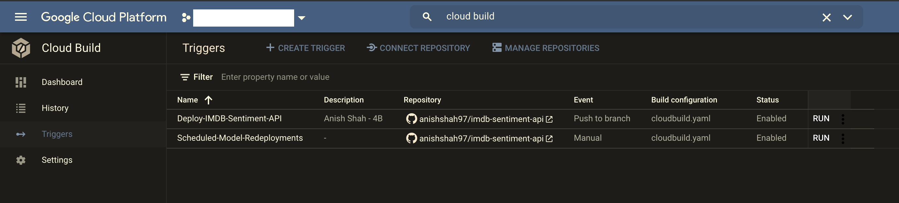
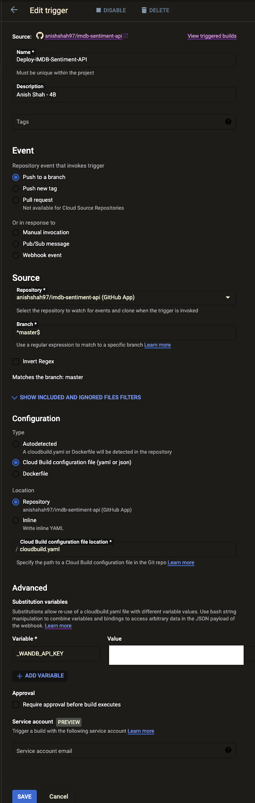
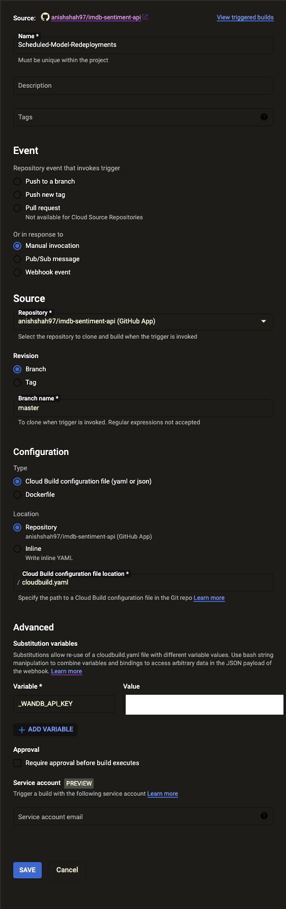
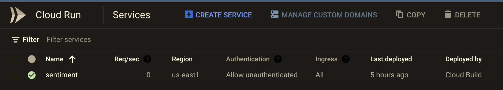
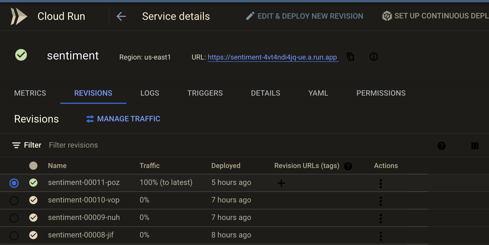
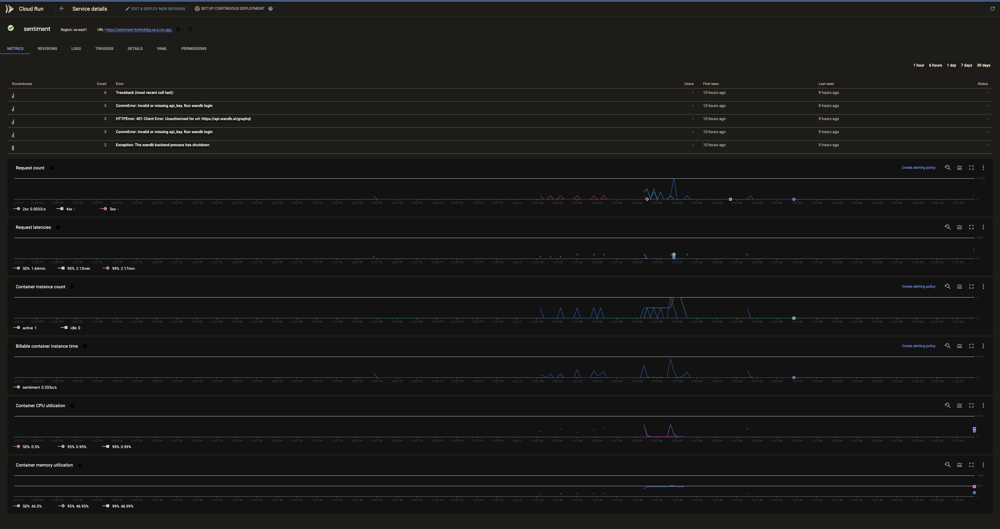
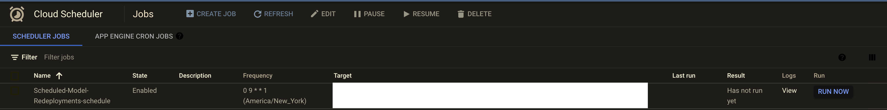
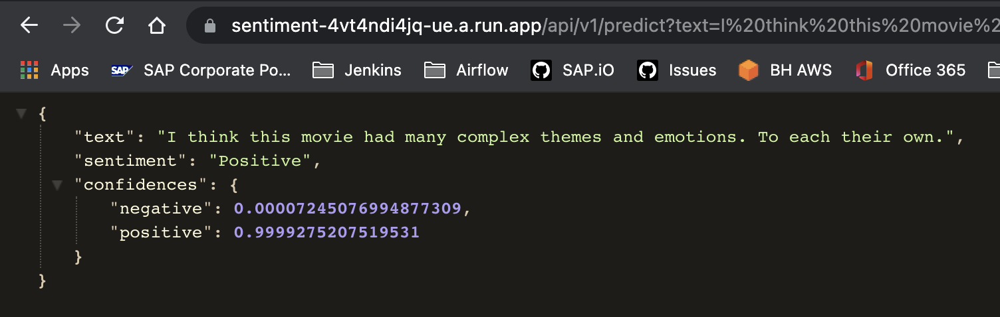
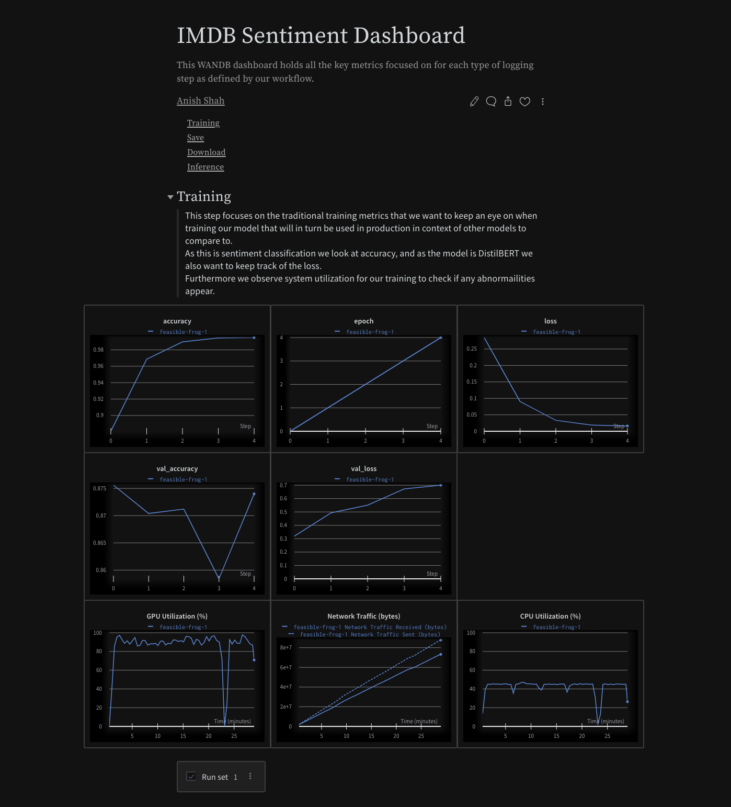
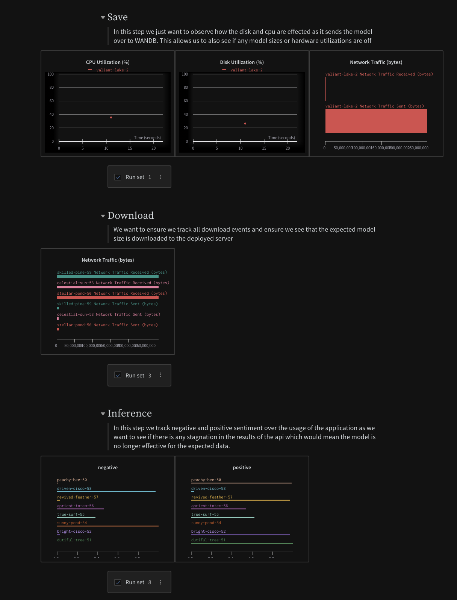

# WANDB API

### CI/CD

Below we capture the CI/CD scenarios that we would expect with our model endpoints.

- In the `automated` build scenario, we capture any changes in the source code for the model server, build the new resultant docker image, push the image to the container registry, and then deploy via cloud run. This captures the CI component.


> Automated builds based on changes in the `master` branch

- In the `scheduled` build scenario, to ensure that we pull the latest model from `wandb` we force the fastapi application to rebuild, which in turn queries the service for the latest recorded model. This ensures we are always serving the most up-to-date model at the endpoint.


> Scheduled builds on `master` to update the endpoint with the latest model

These scenarios together complete the CI/CD flow by allowing us to define a very easy to reproduce structure for defining build triggers based on different branches.

For brevity's sake I did not include the abstraction in this [`cloudbuild.yaml`](./cloudbuild.yaml) however you would simply pass in a substitution variable for the `$MODEL_VERSION` and pass that into the cloud console for that build for that branch. You could also abstract it by the name of the branch.

### Screenshots

#### Cloud Build





> This relies on Cloud Scheduler to schedule the manual trigger run

#### Cloud Run





#### Cloud Scheduler



#### Public API Result



#### WANDB Dashboard




## Development Requirements

- Python3.9.2
- Pip
- Poetry (Python Package Manager)

### M.L Model Environment

```sh
LOCAL_MODEL_DIR = config("LOCAL_MODEL_DIR", default="./ml/model/")
LOCAL_MODEL_NAME = config("LOCAL_MODEL_NAME", default="model.pkl")
MODEL_VERSION = config("MODEL_VERSION", default="latest")
MODEL_LOADER = config("MODEL_LOADER", default="joblib")
WANDB_API_KEY=<API_KEY>
```

### M.L. Model Flavors

[Currently we only have added](app/core/model_loaders.py)

```sh
joblib.load
tf.keras.models.load_model
TFDistilBertForSequenceClassification.from_pretrained
```

### Update `core.events` in `main.py`

In `main.py` we reference a `startup` handler which we imported from `core.events` [(shown here)](app/core/events.py).
This runs on startup of the application.

On startup we use [Weights & Biases](https://wandb.ai/) to pull `LOCAL_MODEL_NAME` from their service and then use `MODEL_LOADER` to load the model before serving the application endpoints.

### Update `/predict`

To update your machine learning model, add your `load` and `method` [change here](app/api/routes/predictor.py) at `predictor.py`.

We adapted the predictor model loader based on `joblib` overwrote the predict function to better suit our `TFDistilBertForSequenceClassification` model.

### Installation

```sh
python -m venv venv
source venv/bin/activate
make install
```

### Runnning Localhost

`make run`

### Deploy app

`make deploy`

### Running Tests

`make test`

### Running Easter Egg

`make easter`

### Access Swagger Documentation

> <http://0.0.0.0:8080/docs>

### Access Redocs Documentation

> <http://0.0.0.0:8080/redoc>

### Project structure

Files related to application are in the `app` or `tests` directories.
Application parts are:

    app
    ├── api              - web related stuff.
    │   └── routes       - web routes.
    ├── core             - application configuration, startup events, logging.
    ├── models           - pydantic models for this application.
    ├── services         - logic that is not just crud related.
    └── main.py          - FastAPI application creation and configuration.
    │
    tests                  - pytest
